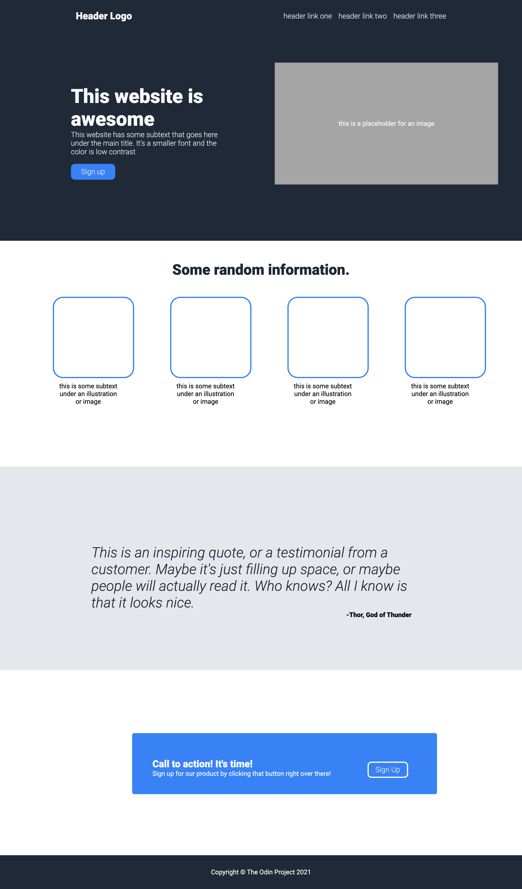

# Odin Landing Page Project

⚠️ OPTIMIZED FOR DESKTOP SCREENS (for now) ⚠️

## Table of contents

- [Overview](#overview)
  - [The challenge](#the-challenge)
  - [Screenshot](#screenshot)
  - [Links](#links)
- [My process](#my-process)
  - [Built with](#built-with)
  - [What I learned](#what-i-learned)
  - [Continued development](#continued-development)
  - [Useful resources](#useful-resources)
- [Author](#author)
- [Acknowledgments](#acknowledgments)

## Overview

### The challenge

For this project, create an entire web page from a design provided for you.

### Screenshot

### Links

- Live Site URL: [Add live site URL here](https://hillaryosei.github.io/odin-landing/)

## My process

### Built with

- HTML5 markup
- CSS3
- Flexbox

### What I learned

- How to amend git commit messages
- How to use Chrome Inspector Tool to debug and try out different codes before officially adding it on my stylesheet
- How to use flexbox

### Continued development

Throughout the project, I encountered major difficulties with how to appropriately use flexbox. I found myself throwing different alignment properties and values, hoping that something would stick eventually. As I learn more advanced HTML and CSS, I will return to this landing page to update the code and make it cleaner.

### Useful resources

- [CSS Tricks](https://www.example.com) - This is an amazing article which helped me get some understanding of flexbox. I'd recommend it to anyone who is learning this concept.

## Author

- LinkedIn - [Hillary Osei](https://www.linkedin.com/in/hillary-osei)

